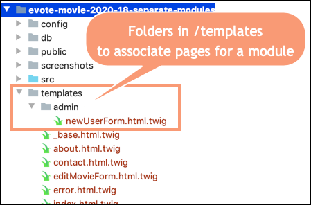

# evote-movie-2020-18-separate-modules

As our website grows more complex, it makse sense to start to organise it into **modules**. By introducing a second variable in our URls `module`, in addition to `action`, we can organsise our Front Controller better, and simplify secruity by making all methods for a module secured against login, or a particular login **ROLE**.

- in our base Twig template `/templates/_base.html.twig` let's add the name/value pair `module=admin` to the GET variables passed in the link for displaying the form for a NEW user:

    ```twig
    <div id="login">
        
            You are logged in as: <b>{{ session.username }}</b>,
            <a href="/index.php?action=logout">logout</a>
    
            
                <br>
                <a href="/index.php?action=newUserForm&module=admin">CREATE new user</a>
            
    
        
            <a href="/index.php?action=login">login</a>
        
    </div>
    ```
  
    - the key line here is: `<a href="/index.php?action=newUserForm&module=admin">CREATE new user</a>`
    
- in the new user form `/templates/newUserForm.html.twig` we will add a second hidden variable `module` with value `admin` to be sent with the other `POST` variables when data for a new user is submitted:

    ```twig
        <form action="/" method="post">
            <input type="hidden" name="action" value="processNewUser">
            <input type="hidden" name="module" value="admin">
    
            <p>
                username:
                <input name="username">
            <p>
                password:
                <input name="password">
            <p>
                <input type="submit">
        </form>
    ```

    - the key line here is `<input type="hidden" name="module" value="admin">`
    
- create a new sub-folder `admin` in the `/templates` folder, and move template `newUserForm.html.twig` into that folder



- update method `newUserForm()` in our `AdminController` class to now include folder `admin` as part of the location of the Twig template to do be disopkayed:

    ```php
    class AdminController extends Controller
    {
        public function newUserForm()
        {
            $template = 'admin/newUserForm.html.twig';
            $args = [];
            $html = $this->twig->render($template, $args);
            print $html;
        }
    
        ... as before
    ```     

- since we are going to introduce some new methods to our `WebApplication` Front Controller, it makes sense to move the local controller variables from our `run()` method to become instance variables, initialised in a constructor method, and so available to **all** methods in the class:

```php
class WebApplication
{
    private $mainController;
    private $movieController;
    private $loginController;
    private $adminContoller;
    
    public function __construct()
    {
        $this->mainController = new MainController();
        $this->movieController = new MovieController();
        $this->loginController = new LoginController();
        $this->adminContoller = new AdminController();
    }

    ... other methods go here ...
```

- we now change our `run()` method to try to find a value for variable `module`, first from the `GET` variables, and failing that, then from the `POST` variables (just like we are doing for `action`):

    ```php
    public function run()
    {
        $action = filter_input(INPUT_GET, 'action');
        if (empty($action)) {
            $action = filter_input(INPUT_POST, 'action');
        }
    
        $module = filter_input(INPUT_GET, 'module');
        if (empty($module)) {
            $module = filter_input(INPUT_POST, 'module');
        }
    ```

- we almost have a much simpler `switch` statement, since we are now trying to determine which **module** the user's action belongs to, before worrying about the action itself:
    
    ```php
        public function run()
        {
            $action = filter_input(INPUT_GET, 'action');
            if (empty($action)) {
                $action = filter_input(INPUT_POST, 'action');
            }
    
            $module = filter_input(INPUT_GET, 'module');
            if (empty($module)) {
                $module = filter_input(INPUT_POST, 'module');
            }
    
            switch ($module) {
                case 'admin':
                    if ($this->loginController->isGranted('ROLE_ADMIN')) {
                        $this->adminFunctions($action);
                    } else {
                        $this->movieController->error('you are not authorised for this action');
                    }
                    break;
                    
                default:
                    $this->defaultFunctions($action);
            }
        }
    ```

    - if `module` has value `admin`, then we test for a logged-in user with role `ROLE_ADMIN`. If found, we pass the value of `action` to method `adminFunctions(...)`. 
    
    - if `module` has value `admin`, but the user did **NOT** have `ROLE_ADMIN`, then we use the MovieController method `error(...)` to display a 'not authorised' message
    
    - If the value of `module` was **NOT** `admin`, we invoke method `defaultFunctiuons(...)` with the value of `action`
    
- method `adminFunctions(...)` has its own `switch` statement, testing for values of `action` to process a submitted new user form, or to display a new user form. We don't need to have any security checking around these cases, since we will only be in this method if the user is logged-in with `ROLE_ADMIN`:

    ```php
    private function adminFunctions($action)
    {
        switch ($action) {
            case 'processNewUser':
                $this->adminContoller->processNewUser();
                break;
    
            case 'newUserForm':
                $this->adminContoller->newUserForm();
                break;
    
            default:
                $this->mainController->home();
        }
    }
    ```
  
    - if the value of `action` is not either `processNewUser` or `newUserForm` then we default to displaying the home page
    
- all of the remaining values of `action` are now tested in a `switch` statement in method `defaultActions(...`:

    ```php
    private function defaultFunctions($action)
    {
        switch ($action) {
            case 'processLogin':
                $this->loginController->processLogin();
                break;
    
            case 'logout':
                $this->loginController->logout();
                break;
    
            case 'login':
                $this->loginController->loginForm();
                break;
    
            case 'processEditMovie':
                if($this->loginController->isLoggedIn()){
                    $this->movieController->processUpdateMovie();
                } else {
                    $this->movieController->error('you are not authorised for this action');
                }
                break;
    
            ... and so on
    ```
    


NOTE: we could take things further by adding another module for **user** (or whatever), which groups together all the actions requiring a user to be logged in (i.e. the `Movie` CRUD actions). This would further organise our code.


